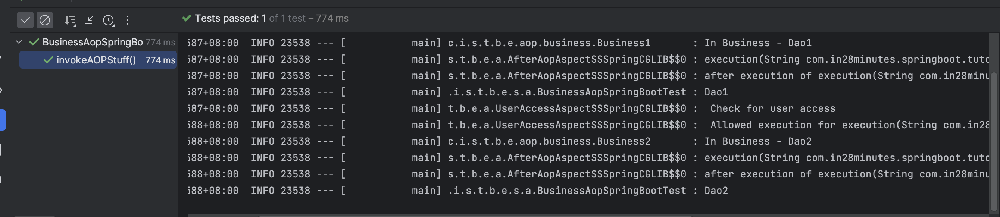
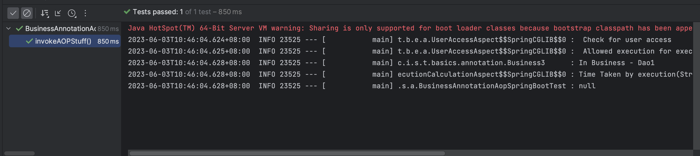

# Aspect-Oriented Programming Quickstart

Example is [here](https://www.springboottutorial.com/spring-boot-and-aop-with-spring-boot-starter-aop)

## Changes Made

- Move the file  `SpringBootTutorialBasicsApplication` from :

- `package com.in28minutes.springboot.tutorial.basics.example;` to    
- `package com.in28minutes.springboot.tutorial.
  basics;`

This changes allow us to have run the unit test scripts targeted to run aspect based on `@annotation`

`BusinessAnnotationAopSpringBootTest` and   
`BusinessAopSpringBootTest`

## Unit Test Results

`BusinessAopSpringBootTest`

`BusinessAnnotationAopSpringBootTest`

